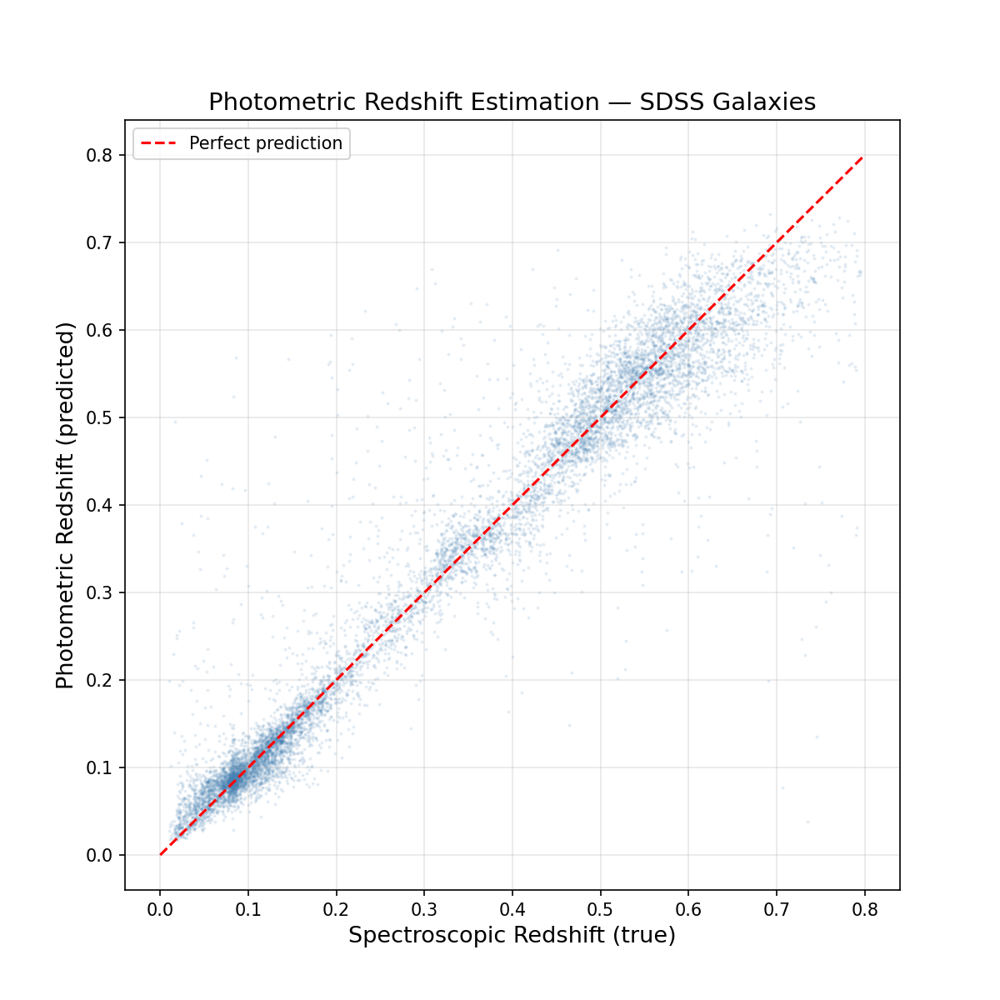
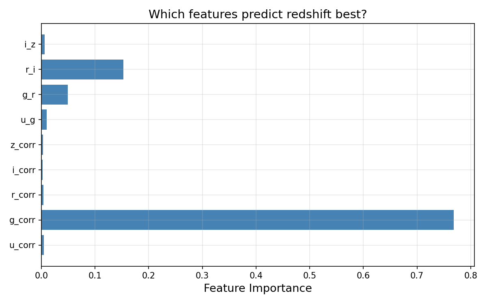

# Photometric Redshift Estimation from SDSS Galaxies

## Overview
Built a machine learning model to estimate galaxy redshifts from broadband photometry alone, without spectroscopic observations. Trained a Random Forest regressor on 40,000 SDSS galaxies with known spectroscopic redshifts and evaluated on 10,000 held-out galaxies.

## Motivation
Spectroscopic redshifts are precise but expensive, each galaxy requires hours of telescope time. Photometric redshifts estimate distance from just 5 brightness measurements, enabling redshift estimation for millions of galaxies that will never be spectroscopically observed. This is critical for large upcoming surveys like LSST/Rubin Observatory.

## Data
- **Source:** SDSS DR18 via astroquery
- **Sample:** 50,000 galaxies with both photometry and spectroscopy
- **Redshift range:** 0.01 < z < 0.80
- **Features:** u, g, r, i, z band magnitudes (extinction corrected) + 4 colour indices (u-g, g-r, r-i, i-z)

## Method
1. Queried SDSS via SQL, joining PhotoObj and SpecObj tables
2. Applied Milky Way dust extinction corrections to all 5 bands
3. Computed colour indices from corrected magnitudes
4. Trained a Random Forest regressor (100 trees, max depth 15)
5. Evaluated on a held-out 20% test set

## Results

| Metric | Value |
|--------|-------|
| RMSE | 0.0546 |
| Bias | -0.0001 |
| Scatter | 0.0546 |

## Feature Importance

The g-band magnitude dominates (~75% importance), driven by the 4000Å break which is a sharp spectral feature in galaxy spectra that shifts through the g-band across the redshift range 0.01–0.80. The model recovered this physically meaningful result without being given any spectral information.

## Tools
Python, scikit-learn, astroquery, numpy, pandas, matplotlib

## References
- SDSS DR18: https://www.sdss4.org
- Ball et al. 2008, ApJ, 683, 12 (photo-z with Random Forests)
